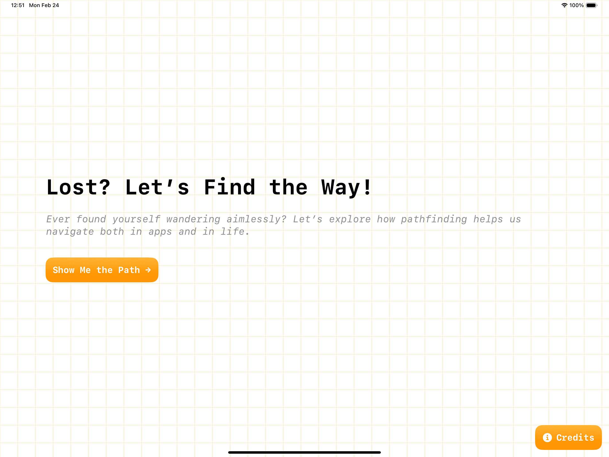
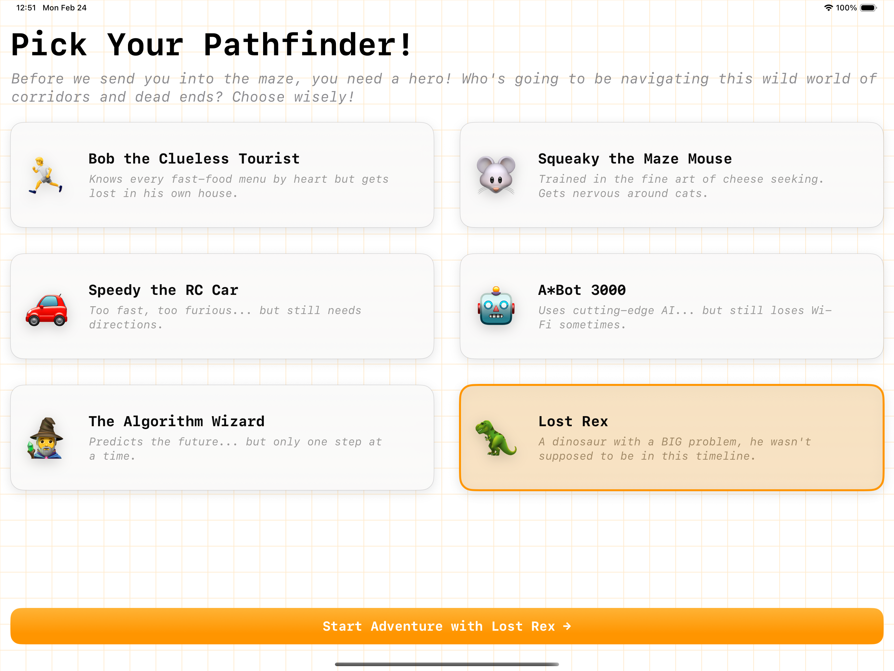
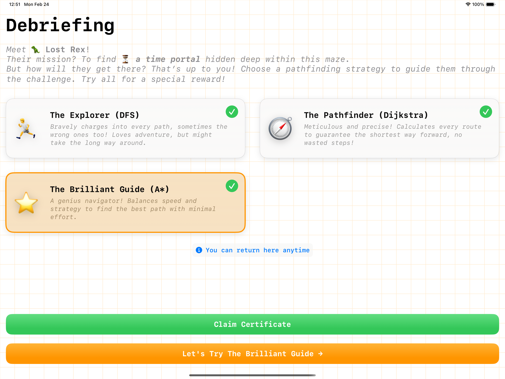
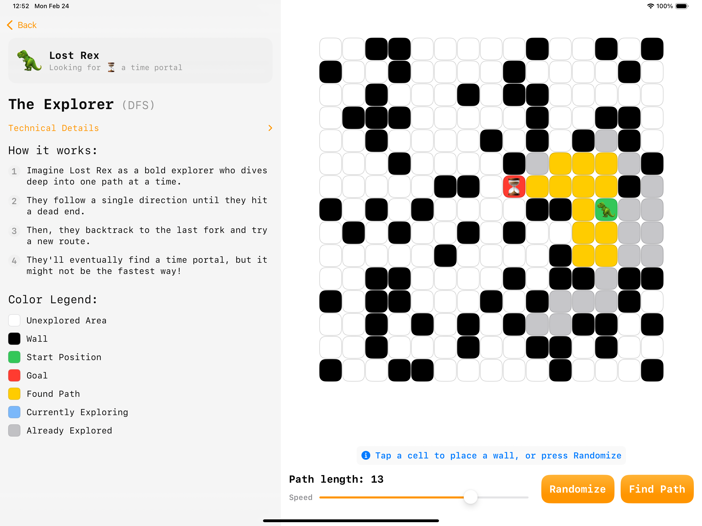
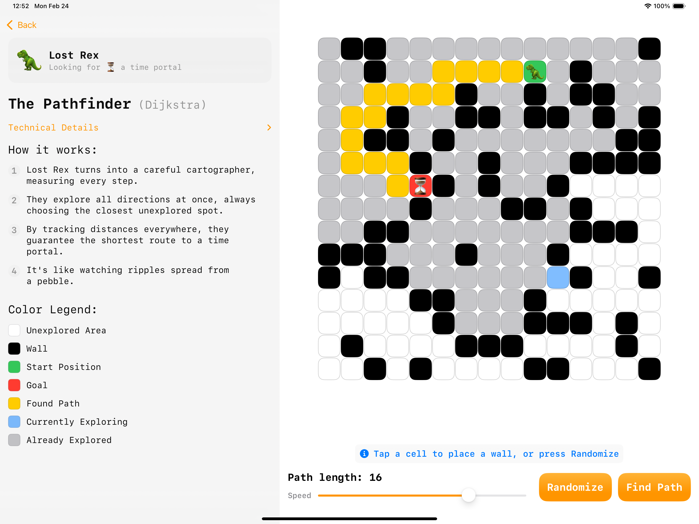
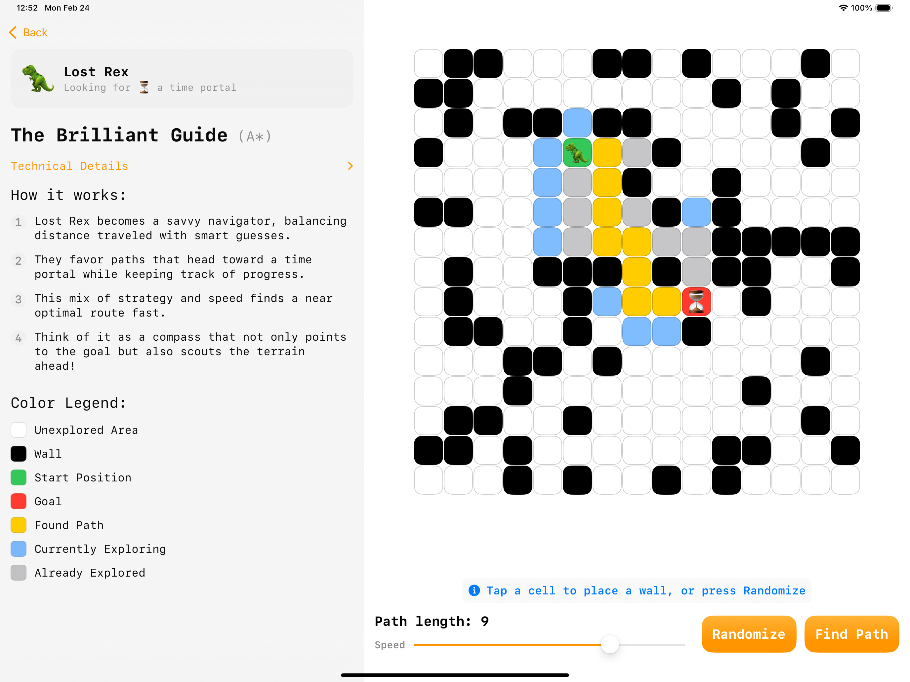

# Swift Student Challenge 2025 - (Not) Lost

An interactive educational playground that visualizes pathfinding algorithms through engaging character-driven scenarios. This project was created for the Swift Student Challenge 2025, demonstrating the power and beauty of algorithms through intuitive visualization.

## Project Overview

(Not) Lost is an educational app that makes learning pathfinding algorithms fun and interactive. Users can choose their character and help them find their way through various mazes while learning about different pathfinding algorithms:

- Depth-First Search (DFS)
- Dijkstra's Algorithm
- A* (A-Star) Algorithm

## Key Features

### 🎮 Interactive Visualization
- Real-time visualization of pathfinding algorithms
- Adjustable animation speed for better understanding
- Interactive grid where users can place walls to create custom mazes
- Randomize feature to generate different maze configurations

### 👾 Character Selection
- Choose from different characters, each with their unique objectives
- Personalized experience that makes learning more engaging

### 🎵 Audio Feedback
- Sound effects for interactions
- Background audio that enhances the user experience
- Success and failure sounds for immediate feedback

## Technical Implementation

### Pathfinding Algorithms

1. **Depth-First Search (DFS)**
   - Explores as far as possible along each branch before backtracking
   - Visualizes the active branch during exploration

2. **Dijkstra's Algorithm**
   - Finds the shortest path between nodes in a graph
   - Visualizes the expansion of the search area

3. **A* (A-Star)**
   - Uses heuristics to guide the search towards the goal
   - Combines actual distance and estimated distance to goal

## Built With

- SwiftUI
- AVKit
- Observation

---

Created with ❤️ for the Swift Student Challenge 2025
